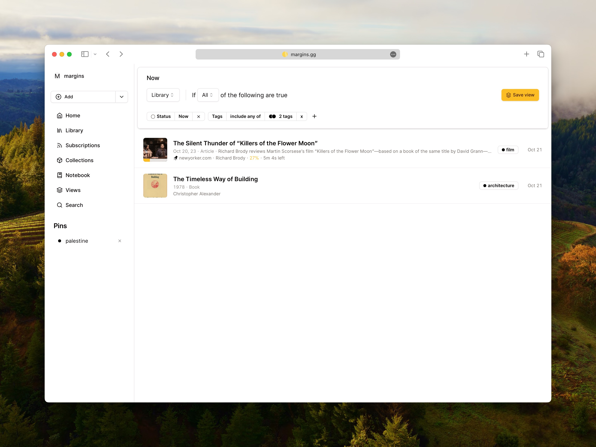
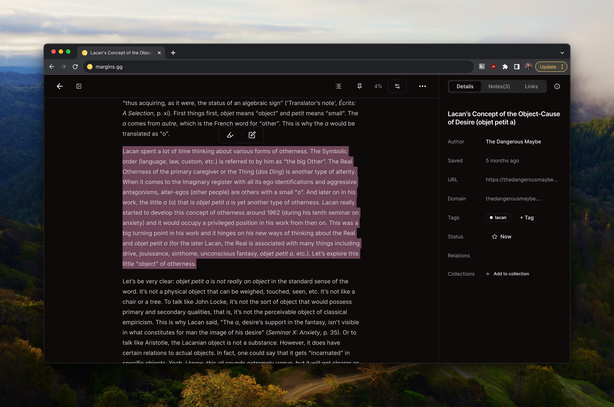
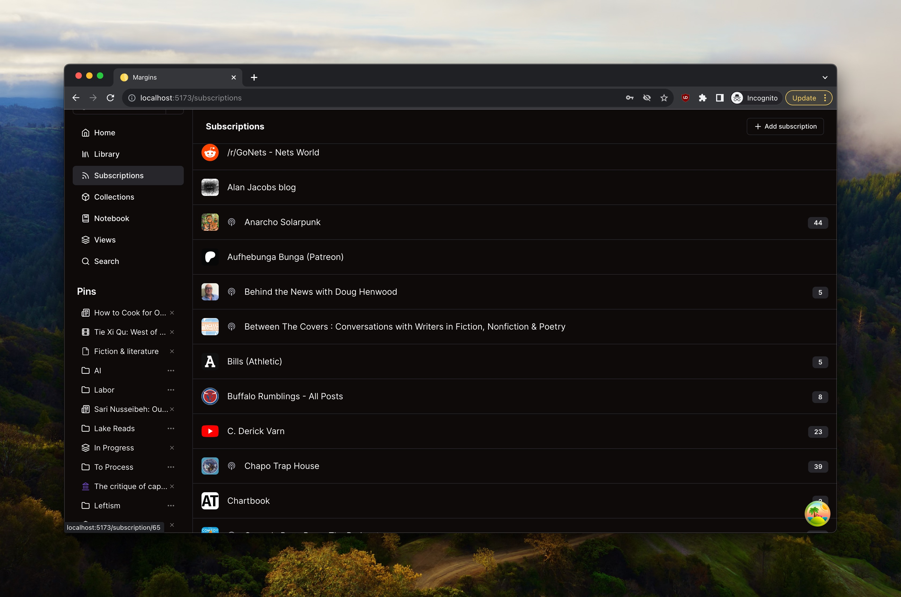
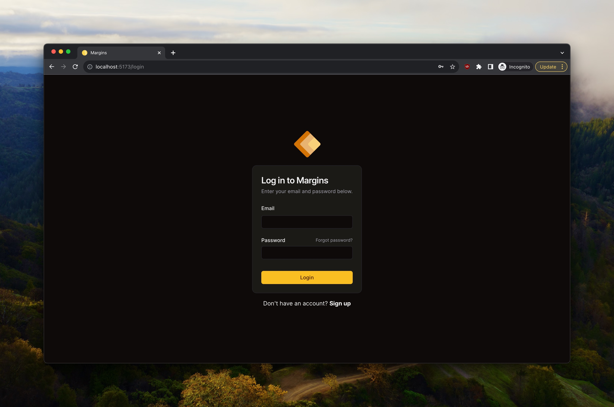

Margins started in 2021 as a way to procrastinate from writing my newsletter, [The Curtain](https://guscuddy.substack.com).

Like all good rabbit holes, it quickly spiraled out of control. I started scratching every itch I could think of for myself, then scrapped the whole thing, then rebuilt it. Many times, over and over.

The result is an app that I use every day, and that I hope others will find useful too.

## What is Margins?

Margins is a read-everything-later research app for infovores and culturevores. It's a place to save and organize all the things you want to read, watch, and listen to. It's a place to take notes, make annotations, and share collections with friends. And it's also a place to discover new things, and to get recommendations from people you trust: subscriptions, newsletters, podcasts, and more.

It's a place to get lost in the margins.

It's heavily influenced by great read-it-later apps like [Pocket](https://getpocket.com/) and [Instapaper](https://www.instapaper.com/), as well as RSS apps like [Feedbin](https://feedbin.com/) and [Fraidycat](https://github.com/kickscondor/fraidycat). But it's also influenced by the way I use [Obsidian](https://obsidian.md), [Notion](https://www.notion.so/), and other apps. And it's influenced by media saving apps like [Goodreads](https://www.goodreads.com/), [Letterboxd](https://letterboxd.com/), and [Last.fm](https://www.last.fm/).

## The Stack

Margins is built with [Svelte](https://svelte.dev/) and [SvelteKit](https://kit.svelte.dev/), and uses [TailwindCSS](https://tailwindcss.com/) for styling. It's hosted on [Vercel](https://vercel.com/), and uses [Planetscale](https://planetscale.com/) MySQL for the database. I'm using [Kysely](https://kysely.dev/) as a query builder, and [Prisma](https://www.prisma.io/) for schema management and migrations. I roll authentication with the help of [Lucia](https://lucia-auth.com).

For a while it used the great [tRPC](https://www.trpc.io/) library for API calls, but I eventually migrated to a homegrown solution that uses similar Typescript magic to generate API routes and types.

I did all the design and development myself, and I'm using [Figma](https://www.figma.com/) for design and prototyping, as well as relying on [Shadcn](https://ui.shadcn.com) (the [Svelte port](https://www.shadcn-svelte.com), which is built off the wonderful component library [Melt UI](https://www.melt-ui.com)).
