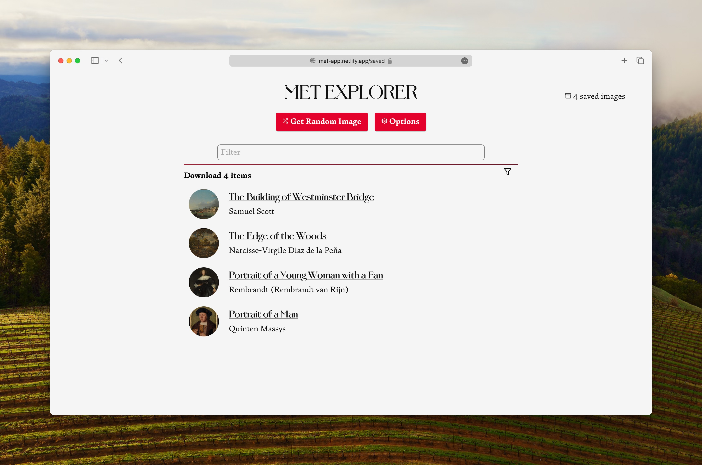
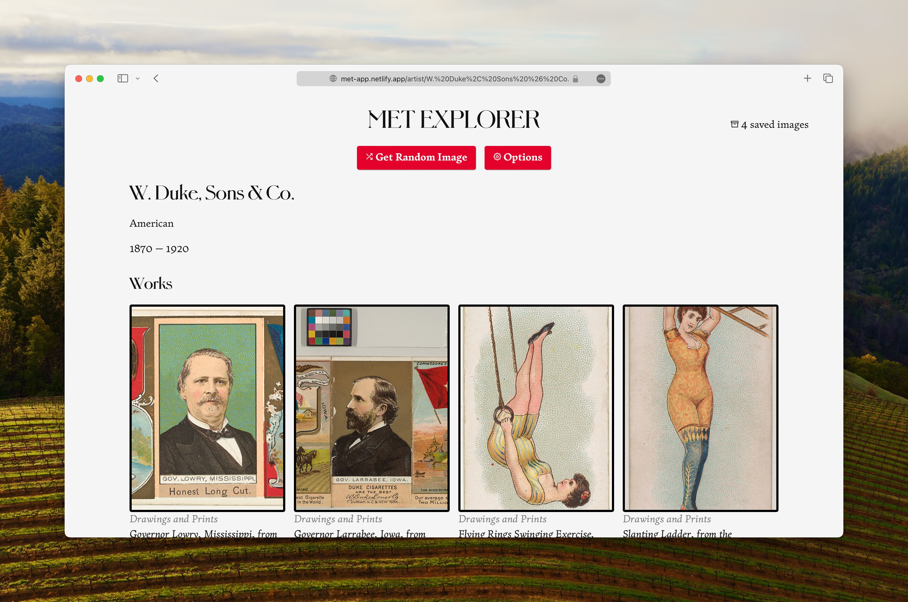

I really like the [Met](https://www.metmuseum.org/). I love their [open collection](https://www.metmuseum.org/art/collection), and I love their [API](https://metmuseum.github.io/). I wanted to build a simple app to explore the collection, and to learn more about the API.

This was also a great learning experience for me as it was the first app I built with [Svelte](https://svelte.dev/) and [SvelteKit](https://kit.svelte.dev/). This is using the pre 1.0 version of SvelteKit.

<figure>
    
    <figcaption>Viewing saved images.</figcaption>
</figure>

It's a really fun way to explore images: I love the serendipity of the random images. I was greatly inspired by the newsletter of [Robin Sloan](https://www.robinsloan.com/), where he shares some fantastic artwork pulled form various open collections online.

## Design

I also had the opportunity to use two fonts from David Jaonathan Ross' [Font of the Month Club](https://djr.com/fotm/). I used [Pomfret](https://djr.com/notes/pomfret-font-of-the-month) for the headings — it's an elegant but fun display font that has an "arts and craft scrapbook" kind of feel. I also used [Fern](https://djr.com/fern) for the body text. It's a really nice serif font that has a lot of character, and is very readable on screens.

<figure>
    
    <figcaption>Viewing an artist details.</figcaption>
</figure>
