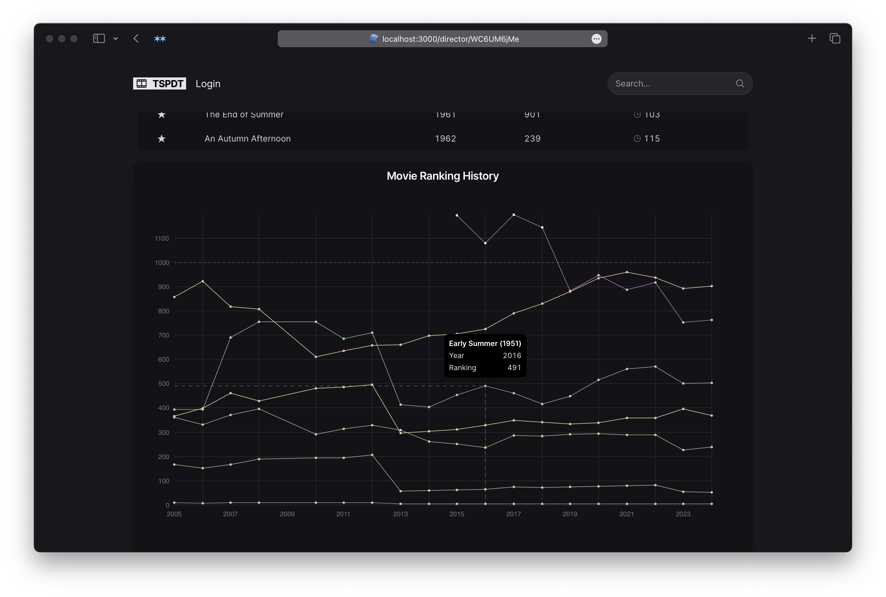
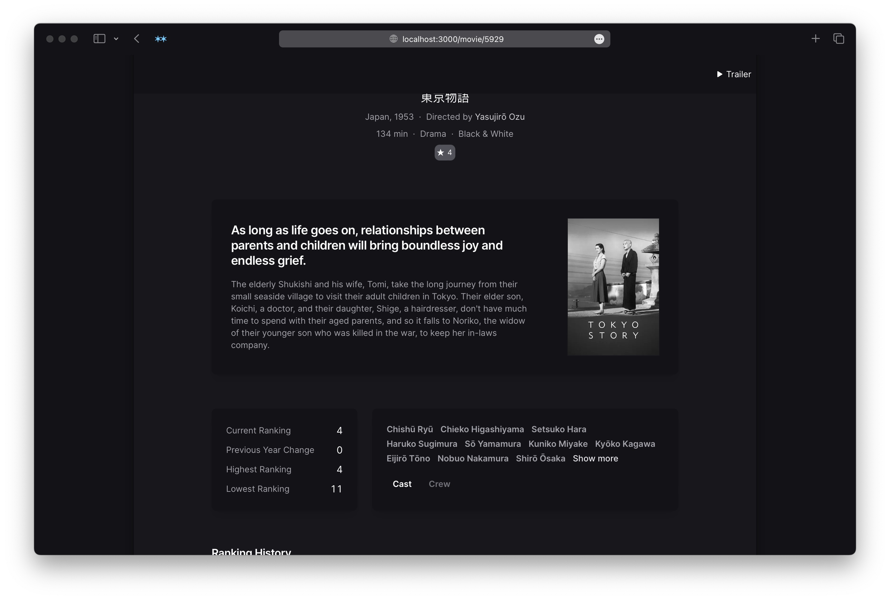
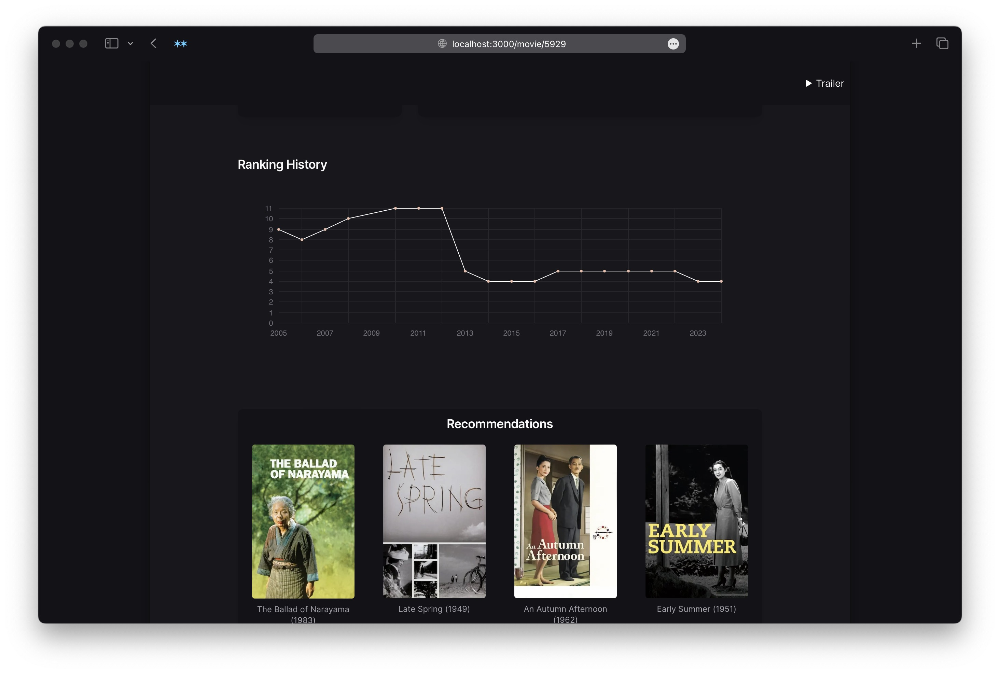

One of my favorite sources for cinephilia is the wonderful greatest films compilation website [They Shoot Pictures, Don't They?](https://www.theyshootpictures.com/). They provide a CSV of their starting list of 24,000 films, as well as the films' historical rankings. It was a fun data spelunking project to turn it into a beautiful and fast movie explorer.

