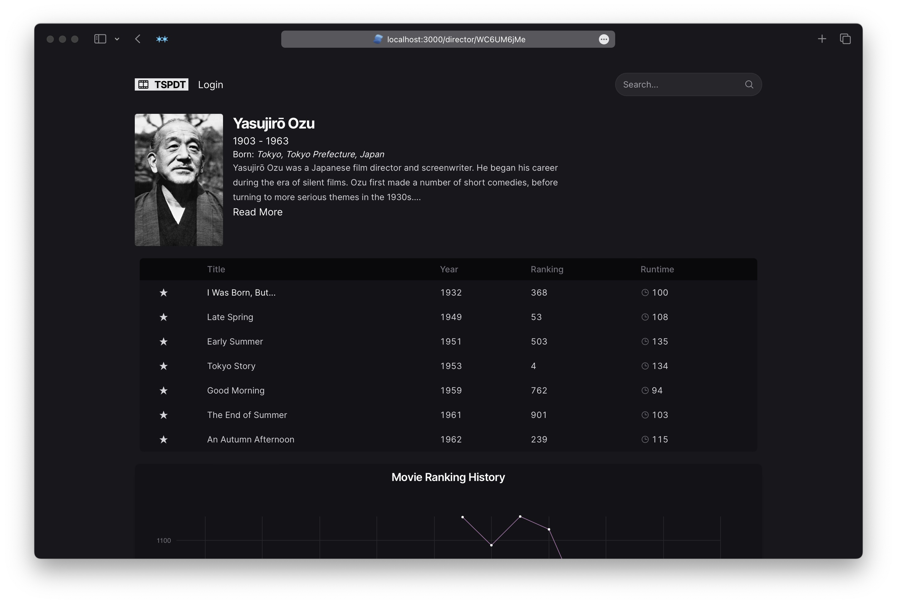

One of my favorite sources for cinephilia is the wonderful greatest films compilation website [They Shoot Pictures, Don't They?](https://www.theyshootpictures.com/). They provide a CSV of their starting list of 24,000 films, as well as the films' historical rankings. It was a fun data spelunking project to turn it into a beautiful and fast movie explorer.

I started with the CSV, transformed and parsed it into a SQLite Database, and then ran some scripts to look up all the movies in TMDB and extract text embeddings and insert them into a vector database.

From there, I built out a UI using Next.js App Router and React Server Components, and a Hono Cloudflare Worker for the API (this allowed easier integration with Cloudflare Services).

I relied on D3 and the React Nivo library for data visualization.

